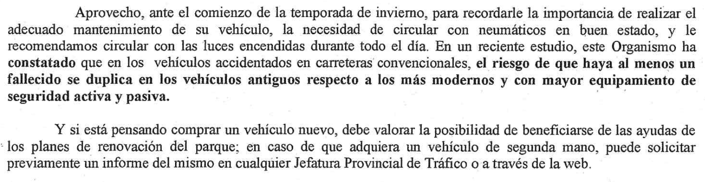
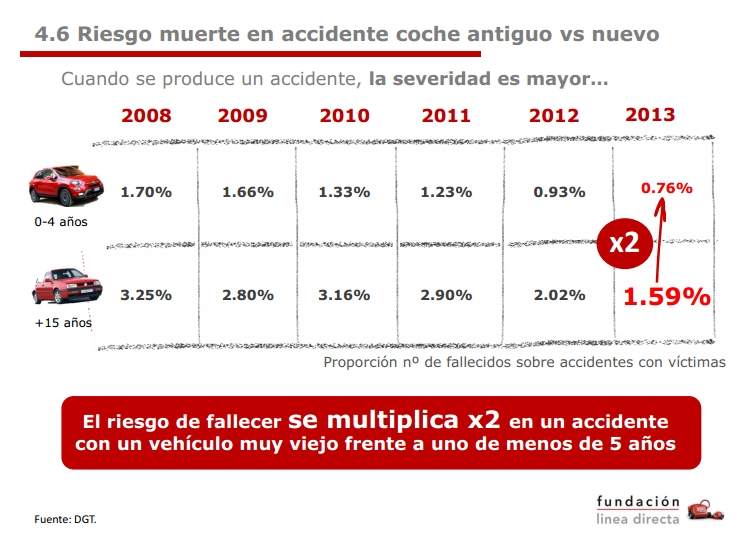
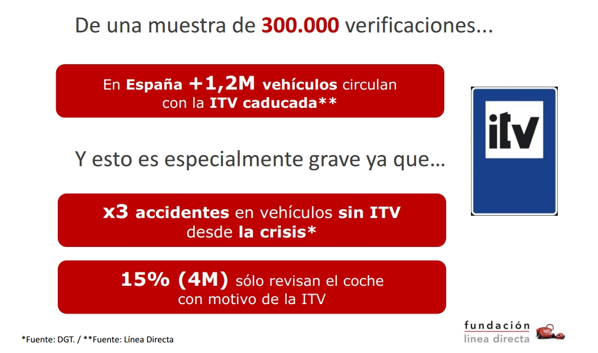

Estudio *provocado* por la carta de la DGT de 2013 informando a propietarios de coches con > 10 años antiguedad

   

***

¿Reciente estudio? ¿De quién? ¿Dónde está? 

Hay varios, que oscilan entre lo ¿burdo?

***


***

Y otro que publica resultados sin dato alguno que lo soporte



***

Y de ahí que:


***

## ¿Datos? {data-background-iframe="https://sedeapl.dgt.gob.es/WEB_IEST_CONSULTA/subcategoria.faces"}

Preguntamos por datos accidentalidad en España y DGT fue muy amable por twitter señalar la siguiente [dirección web para microdatos](https://sedeapl.dgt.gob.es/WEB_IEST_CONSULTA/subcategoria.faces), aunque ¡ojo! en el último momento en que he consultado esta web sólo dispone de datos hasta 2013. 

Es interesante señalar que disponemos también de [informes predefinidos](https://sedeapl.dgt.gob.es/WEB_IEST_CONSULTA/buscadorInformePredefinido.faces), básicamente tablas que cruzan variables importantes de clasificación. (Y después de contestar a un captcha...)


***

# Datos de 2013

Descargamos y descomprimimos el .zip y nos encontraremos con 3 csv, tablas separadas para accidentes, personas implicadas, y vehículos.


```{r}
setwd("C:/Users/pedroc/Desktop/dgt")

csvfiles <- list.files(pattern = glob2rx("*.csv"))

print(csvfiles)
```


## Accidentes en España 2013

```{r}

accid <- read.table("TABLA_ACCVICT_2013.csv",
                    header = T,
                    sep = ";",
                    colClasses = c(rep("character", 2),
                                   "integer",
                                   "factor",
                                   rep("integer", 4),
                                   "character", # para tener los cod "0xxxx"
                                   rep("numeric", 9),
                                   rep("factor", 18)),
                    quote = "")
dim(accid)
```

***
## header

```{r}
head(accid)

```

***
## summary
```{r}
summary(accid)

```


***
# La gran mayoría de accidentes, afortunadamente, no tienen víctimas mortales. 

Total muertos en accidente 2013: 1348
(En anuario accidentes 2013, DGT informa de 1230 muertos vías interurbanas, 450 en urbanas. Incluyen peatones y otros usuarios de carreteras o calles)

```{r}
table(accid$MUERTOS)
sum(table(accid$MUERTOS[accid$MUERTOS > 0]))
```

***

```{r}

barplot(table(accid$MUERTOS))

```

# Muchas variables son códigos

¡¡ENLACE IMPRESCINDIBLE!! [El "diseño de registro"](https://sedeapl.dgt.gob.es/IEST_INTER/pdfs/disenoRegistro/accidentes/Diseno_Registro_desde_2011.zip)

Ojo por si alguien quiere hacer serie histórica de accidentes que a fecha de escribir esto (31-03-2016, los datos de 2008 y 2010 **no** estaban disponibles en la página DGT)

## Leamos los códigos de la excel de accidentes

```{r}

library(xlsx)

prov <- read.xlsx(file = "Tabla_accidentes_diccionario_datos_desde_2011.xlsx", 
                  sheetName = "PROVINCIA",
                  encoding = "UTF-8",
                  startRow = 3)

comauto <- read.xlsx(file = "Tabla_accidentes_diccionario_datos_desde_2011.xlsx", 
                  sheetName = "COMUNIDAD_AUTONOMA",
                  encoding = "UTF-8",
                  startRow = 3)

zona <- read.xlsx(file = "Tabla_accidentes_diccionario_datos_desde_2011.xlsx", 
                  sheetName = "ZONA",
                  encoding = "UTF-8",
                  startRow = 3)

zonagrup <- read.xlsx(file = "Tabla_accidentes_diccionario_datos_desde_2011.xlsx", 
                  sheetName = "ZONA_AGRUPADA",
                  encoding = "UTF-8",
                  startRow = 3)

carret_titular <- read.xlsx(file = "Tabla_accidentes_diccionario_datos_desde_2011.xlsx", 
                  sheetName = "RED_CARRETERA",
                  encoding = "UTF-8",
                  startRow = 3)

tipovia <- read.xlsx(file = "Tabla_accidentes_diccionario_datos_desde_2011.xlsx", 
                  sheetName = "TIPO_VIA",
                  encoding = "UTF-8",
                  startRow = 3)

superficie <- read.xlsx(file = "Tabla_accidentes_diccionario_datos_desde_2011.xlsx", 
                  sheetName = "SUPERFICIE_CALZADA",
                  encoding = "UTF-8",
                  startRow = 3)

luminosidad <- read.xlsx(file = "Tabla_accidentes_diccionario_datos_desde_2011.xlsx", 
                  sheetName = "LUMINOSIDAD",
                  encoding = "UTF-8",
                  startRow = 3)

tiempoatmos <- read.xlsx(file = "Tabla_accidentes_diccionario_datos_desde_2011.xlsx", 
                  sheetName = "FACTORES_ATMOSFERICOS",
                  encoding = "UTF-8",
                  startRow = 3)

visibilidad <- read.xlsx(file = "Tabla_accidentes_diccionario_datos_desde_2011.xlsx", 
                  sheetName = "VISIBILIDAD_RESTRINGIDA",
                  encoding = "UTF-8",
                  startRow = 3)

otracircunstancia <- read.xlsx(file = "Tabla_accidentes_diccionario_datos_desde_2011.xlsx", 
                  sheetName = "OTRA_CIRCUNSTANCIA",
                  encoding = "UTF-8",
                  startRow = 3)

tipoaccidente <- read.xlsx(file = "Tabla_accidentes_diccionario_datos_desde_2011.xlsx", 
                  sheetName = "TIPO_ACCIDENTE",
                  encoding = "UTF-8",
                  startRow = 3)

densidad <-  read.xlsx(file = "Tabla_accidentes_diccionario_datos_desde_2011.xlsx", 
                  sheetName = "DENSIDAD_CIRCULACION",
                  encoding = "UTF-8",
                  startRow = 3)


```

## Algunas pestañas de Excel dan problemas

Las metemos a mano

```{r}

prioridad <- data.frame(valor = seq(0, 8),
                        etiqueta = c("SIN DATO",
                                     "AGENTE",
                                     "SEMÁFORO",
                                     "STOP",
                                     "CEDA EL PASO",
                                     "SOLO MARCAS VIALES",
                                     "PASO PARA PEATONES",
                                     "OTRA SEÑAL",
                                     "NINGUNA"))


acond_calzada <- data.frame(valor = seq(0, 6),
                            etiqueta = c("SIN DATO",
                                         "NADA ESPECIAL",
                                         "SÓLO ISLETAS O PASO PARA PEATONES",
                                         "PASO PARA PEATONES O ISLETAS EN CENTRO DE VÍA PRINCIPAL",
                                         "CARRIL CENTRAL DE ESPERA",
                                         "RAQUETA DE GIRO IZQUIERDA",
                                         "OTRO TIPO"))

tipo_interseccion <- data.frame(valor = seq(1, 6),
                                etiqueta = c("EN T Ó Y",
                                             "EN X Ó +",
                                             "ENLACE DE ENTRADA",
                                             "ENLACE DE SALIDA",
                                             "GIRATORIA",
                                             "OTROS"))

trazado <- data.frame(valor = seq(1, 5),
                      etiqueta = c("RECTA",
                                   "CURVA SUAVE",
                                   "CURVA FUERTE SIN SEÑALIZAR",
                                   "CURVA FUERTE CON SEÑAL Y SIN VELOCIDAD SEÑALIZADA",
                                   "CURVA FUERTE CON SEÑAL Y VELOCIDAD SEÑALIZADA"))
```


## Mezclamos etiquetas de variables relevantes en tabla accidentes

```{r}

zonagrup$zonagrup <- as.numeric(zonagrup$Valor == 1)
zonagrup$zonagrup[zonagrup$zonagrup == 0] <- "urbana"
zonagrup$zonagrup[zonagrup$zonagrup == 1] <- "interurb"
zonagrup$zonagrup <- as.factor(zonagrup$zonagrup)
accidentes <- merge(accid,
                    zonagrup[, c(1, 3)],
                    by.x = "ZONA_AGRUPADA",
                    by.y = "Valor",
                    all.x = T,
                    all.y = F)

prioridad$paro_requerido <- "no"
prioridad$paro_requerido[prioridad$valor > 0] <- "sí"
prioridad$paro_requerido <- as.factor(prioridad$paro_requerido)
accidentes <- merge(accidentes,
                    prioridad[, c(1, 3)],
                    by.x = "COD_PRIORIDAD",
                    by.y = "valor",
                    all.x = T,
                    all.y = F)

visibilidad$visibilidad <- as.numeric(visibilidad$Valor > 0)
visibilidad$visibilidad[visibilidad$visibilidad == 0] <- "sin problema"
visibilidad$visibilidad[visibilidad$visibilidad == 1] <- "problemas"
visibilidad$visibilidad <- as.factor(visibilidad$visibilidad)
accidentes <- merge(accidentes,
                    visibilidad[, c(1, 3)],
                    by.x = "VISIBILIDAD_RESTRINGIDA",
                    by.y = "Valor",
                    all.x = T,
                    all.y = F)

luminosidad$luminosidad <- as.numeric(luminosidad$Valor > 3)
luminosidad$luminosidad[luminosidad$luminosidad == 0] <- "buena/día"
luminosidad$luminosidad[luminosidad$luminosidad == 1] <- "mala/noche"
luminosidad$luminosidad <- as.factor(luminosidad$luminosidad)
accidentes <- merge(accidentes,
                    luminosidad[, c(1,3)],
                    by.x = "COD_LUMINOSIDAD",
                    by.y = "Valor",
                    all.x = T,
                    all.y = F)

names(tiempoatmos)[2] <- "cond_atmosfericas"
tiempoatmos$cond_atmosfericas <- as.character(tiempoatmos$cond_atmosfericas)
tiempoatmos$cond_atmosfericas[tiempoatmos$cond_atmosfericas %in% 
                                c("BUEN TIEMPO", "OTRO")] <- "bueno"
tiempoatmos$cond_atmosfericas[tiempoatmos$cond_atmosfericas %in% 
                                c("NIEBLA LIGERA")] <- "niebla"
tiempoatmos$cond_atmosfericas[tiempoatmos$cond_atmosfericas %in% 
                                c("LLOVIZNANDO", "VIENTO FUERTE")] <- "lluvia/viento"
tiempoatmos$cond_atmosfericas[tiempoatmos$cond_atmosfericas %in% 
                                c("LLUVIA FUERTE", "NIEBLA INTENSA", 
                                  "GRANIZANDO", "NEVANDO")] <- "extremas"
tiempoatmos$cond_atmosfericas <- as.factor(tiempoatmos$cond_atmosfericas)
accidentes <- merge(accidentes,
                    tiempoatmos,
                    by.x = "COD_FACTORESATMOSFERICOS",
                    by.y = "Valor",
                    all.x = T,
                    all.y = F)

densidad$densidad <- as.numeric(densidad$Valor == 1)
densidad$densidad[densidad$densidad == 0] <- "otra"
densidad$densidad[densidad$densidad == 1] <- "fluida"
densidad$densidad <- as.factor(densidad$densidad)
accidentes <- merge(accidentes,
                    densidad,
                    by.x = "DENSIDAD_CIRCULACION",
                    by.y = "Valor",
                    all.x = T,
                    all.y = F)

names(tipoaccidente)[2] <- "tipoaccidente"
accidentes <- merge(accidentes,
                    tipoaccidente,
                    by.x = "COD_TIPOACCIDENTE",
                    by.y = "Valor",
                    all.x = T,
                    all.y = F)

library(stringr)
accidentes$tipogrupo <- word(accidentes$tipoaccidente)
accidentes$tipogrupo <- as.factor(accidentes$tipogrupo)
table(accidentes$tipogrupo)
summary(accidentes)

```

# Tipos de accidente con resultado mortal

```{r}

t <- table(accidentes$tipoaccidente[accidentes$MUERTOS > 0])
t <- sort(t, decreasing = T)
barplot(head(t, n = 10),
        las = 1,
        horiz = T)

```


# Factores de riesgo en TODOS los accidentes

## Un árbol de decisión


## Factores de riesgo (I)

Para todos los accidentes, todo tipo de vehículos, hay un factor esencial de riesgo, que son las condiciones de iluminación. En aquellos accidentes que no tienen lugar en intersecciones o regulación de tráfico (p.ej. stop) y que suceden en vías interurbanas, si es de noche con iluminación insuficiente o sin ninguna, el riesgo de tener víctimas mortales se duplica, y es el más alto de todas las situaciones, pasando de 16.4% (día o iluminación suficiente) a un 30.8% (iluminación insuficiente o ninguna). En vías urbanas, en cambio, el riesgo es de un 6% (en situaciones de visibilidad restringida).

## Factores de riesgo (II)

Y todavía más, en vías interurbanas, de noche y sin iluminación, la condición atmosférica de niebla intensa hace que casi se quintuplique el riesgo de víctimas mortales frente a las otras condiciones atmosféricas (5% a 23.1%). 

En zonas urbanas la influencia de iluminación es también determinante, en condiciones insuficientes o sin iluminación el riesgo pasa de 2 a un 4%.


***
# Leemos los datos de vehículos

```{r}

vehic <- read.table("TABLA_VEHIC_2013.csv",
                    header = T,
                    sep =",")

dim(vehic)

summary(vehic)

```

***

## Unas mínimas manipulaciones necesarias:

```{r}

vehic$ID_ACCIDENTE <- as.character(vehic$ID_ACCIDENTE)
vehic$ID_VEHICULO  <- as.factor(vehic$ID_VEHICULO)
vehic$ANIO_MATRICULA_VEHICULO[vehic$ANIO_MATRICULA_VEHICULO > 2015] <- NA
vehic$ANIO_MATRICULA_VEHICULO  <- as.factor(vehic$ANIO_MATRICULA_VEHICULO)
vehic$MES_MATRICULA_VEHICULO[vehic$MES_MATRICULA_VEHICULO == 99] <- NA
vehic$MES_MATRICULA_VEHICULO  <- as.factor(vehic$MES_MATRICULA_VEHICULO)
vehic$TIPO_VEHICULO  <- as.factor(vehic$TIPO_VEHICULO)
vehic$ESTADO_VEHICULO  <- as.factor(vehic$ESTADO_VEHICULO)
vehic$NUMERO_OCUPANTES_VEH[vehic$NUMERO_OCUPANTES_VEH == 999] <- NA

```

***
```{r}
summary(vehic)
```

***

35% de los vehículos no tienen antiguedad

¡Tenemos 3 vehículos de 1900! Y 2 anteriores a la II Guerra Mundial (!). Y 54319 NA's (!!!!!), nada menos que un 35%.

```{r}
table(vehic$ANIO_MATRICULA_VEHICULO, exclude = NULL)
round(table(vehic$ANIO_MATRICULA_VEHICULO, exclude = NULL)/nrow(vehic)*100, digits = 3)

```


***

# Filtramos los turismos

código 22 son turismos, representan el 65.5% de los datos. Los filtramos porque son el tipo de vehículos en los que nos vamos a concentrar

```{r, echo = FALSE}

turismos <- vehic[vehic$TIPO_VEHICULO == 22,]

barplot(table(turismos$ANIO_MATRICULA_VEHICULO))

```

***

# 4 grupos## Factores de riesgo (I)

Hacemos grupos de 5 en 5 años hasta 20 y más de 20
```{r, echo = FALSE}
turismos$edad <- as.integer(as.character(turismos$ANIO_MATRICULA_VEHICULO))

turismos$gredad <- cut(turismos$edad, breaks = c(1900, 1998, 2003, 2008, 2013))
```


```{r, echo = FALSE}
barplot(table(turismos$gredad))
```


# Mezclamos ambas fuentes de información

Mezclamos la información de accidentes con la de vehículos. Tenemos ID_ACCIDENTE e ID_VEHICULO que debemos cruzar con misma ID de accidente pero "VEHICULOSIMPLICADOS" en tabla accidentes...

```{r}
datos <- merge(accidentes, 
               turismos,
               by.x = c("ID_ACCIDENTE", "VEHICULOSIMPLICADOS"),
               by.y = c("ID_ACCIDENTE", "ID_VEHICULO"),
               all.x = F,
               all.y = T)
dim(accid); dim(turismos); dim(datos)
```

(Hay 240 accidentes sin vehículo que no se mezclan porque generan todo NA's)

***
```{r}
summary(datos)

```

# Problemas con los datos

Hay nada menos que 45701 turismos en la tabla que *no figuran* en la tabla de accidentes.

Y nos falta la edad, el año de matrícula, de 30104 vehículos.

12880 de ellos de la comunidad autónoma "Cataluña"

```{r}
table(datos$COMUNIDAD_AUTONOMA, datos$gredad, exclude = NULL)
```

## ¿Nos afecta esta falta de datos?

```{r}

t <- table(datos$COMUNIDAD_AUTONOMA[datos$MUERTOS > 0], exclude = NULL)
t <- table(datos$COMUNIDAD_AUTONOMA[datos$MUERTOS > 0]); sum(t)

sum(t)/sum(table(accid$MUERTOS[accid$MUERTOS > 0]))
```

Los accidentes con víctimas mortales parece que sí disponen de la información de comunidad autónoma.

Según estos datos, turismos están involucrados en un 55% de accidentes con víctimas mortales

# Intentamos corrobar hipótesis del "doble riesgo de fallecer"

Datos de frecuencias

```{r}
table(datos$gredad, datos$MUERTOS)
table(datos$gredad[datos$MUERTOS > 0])
sum(table(datos$gredad[datos$MUERTOS > 0]))

```

Nos falta dato de antiguedad de 50 vehículos en accidentes mortales

# En proporciones por número de accidentes 

```{r}
round(table(datos$gredad, datos$MUERTOS) / length(unique(datos$ID_ACCIDENTE)), digits = 4) * 10000

```

Técnicamente, hay posibilidades de 14 entre 10000 de resultar muerto en accidente en coche de menos 5 años, versus 30 5 a 10 años, 26 de 10 a 15 y 18 para los de más de 15 años.


# ¿Validamos o falseamos?

¡¡YO NO OBSERVO ESA DIFERENCIA QUE MENCIONA FUNDACIÓN LÍNEA DIRECTA!!

¡¡SÍ observo esa relación 2 a 1 en los vehículos de entre 5 y 10 años y 10 y 15 años!!

# ¿QUÉ PUEDE ESTAR PASANDO?

Simplificamos datos de muertos en accidente (con o sin muertos)
```{r}
datos$muertos <- cut(datos$MUERTOS, 
                     breaks = c(-1, 0, 4),
                     labels = c("0 muertos",
                                ">0 muert"))
table(datos$muertos)

```

***
Mosaic plots están muy bien en librería vcd

```{r, warning=FALSE}
library(vcd)
?mosaic
```
***
```{r, echo=FALSE}
mosaic(~ gredad +
         COMUNIDAD_AUTONOMA +
         muertos,
       data = datos,
       shade = T)

```

**DEBEMOS SABER QUE FALTAN CASI TODOS LOS DE CATALUÑA (8), SON NA's**

```{r, echo=FALSE}
mosaic(~ gredad +
         COMUNIDAD_AUTONOMA +
         MUERTOS,
       data = datos[datos$MUERTOS > 0,],
       shade = T)

```


***

Esa hipótesis, que vehículos más viejos tienen mayor "riesgo" sólo se sostiene en comunidades autónomas concretas, que son las que menos accidentes tienen. En suma: menos accidentes pero más graves para coches viejos (>20 años) en

* 2	Aragón
* 3	Asturias, Principado de
* 5	Canarias
* 6	Cantabria
* 7	Castilla y León
* 8	Castilla-La Mancha
* 11	Extremadura
* 12	Galicia
* 14	Murcia, Región de
* 15	Navarra, Comunidad Foral de
* 16	Rioja, La

***

Sin embargo sucede precisamente todo lo contrario en las comunidades autónomas más pobladas: 

* 1	Andalucía
* 4	Balears, Illes
* 13	Madrid, Comunidad de
* 17	País Vasco

(Etiquetados como Cataluña sólo tenemos 1741 casos, versus p.ej., 8715 Madrid -> Datos de Cataluña vienen en su mayoría sin código CA)

***

Insistimos, ¿qué puede estar pasando?
El mismo informe de línea directa da una pista esencial

 

#APÉNDICE

## Exploración de factores de riesgo en TODOS los accidentes

```{r}
library(party)

accid$target <- as.numeric(accid$MUERTOS > 0)


tree.1 <- ctree(target ~ MES + COD_DIASEMANA +
                #         COD_PROVINCIA + 
                #         COD_ZONA + 
                         ZONA_AGRUPADA + 
                #         CARRETERA + 
                #         COD_RED + 
                         COD_CALZADA +
                         TRAZADO_NO_INTERSEC + COD_TIPOINTERSECCION + 
                         ACOND_CALZADA + 
                #         COD_PRIORIDAD +
                         COD_SUPERFICIECALZADA + COD_LUMINOSIDAD + 
                         COD_FACTORESATMOSFERICOS +
                         VISIBILIDAD_RESTRINGIDA + 
                #         OTRA_CIRCUNSTANCIA + 
                #         COD_TIPOACCIDENTE + 
                          DENSIDAD_CIRCULACION
                , 
                  data = accid, 
                  controls = ctree_control(maxdepth = 4)
  )
  
  print(tree.1)  
  
  plot(tree.1, type = "simple")


```

La visibilidad es el principal factor que influye en que un accidente resulte con víctimas mortales, en el conjunto global de accidentes (todo tipo de vehículos, todo tipo de accidentes). De tal modo que en situaciones de noche y sin iluminación de la vía, condiciones de visibilidad restringida CONFIGURACIÓN DEL TERRENO
FACTORES ATMOSFÉRICOS
DESLUMBRAMIENTO
POLVO O HUMO

producen que se duplique la proporción de accidentes (0.05 vs. 0.10) con víctimas mortales.

Asimismo en curvas, situaciones de baja visibilidad como son el terreno o los deslumbramientos hacen que esta proporción pase de 0.035 a 0.07. Estas proporciones corresponden a situaciones de iluminación de día o noche con iluminación y por eso son mucho menores que las anteriores de noche sin iluminación.


```{r}

tree.2 <- ctree(target ~ MES + COD_DIASEMANA +
                #         COD_PROVINCIA + 
                #         COD_ZONA + 
                         ZONA_AGRUPADA + 
                #         CARRETERA + 
                #         COD_RED + 
                #         COD_CALZADA +
                         TRAZADO_NO_INTERSEC + COD_TIPOINTERSECCION + 
                #         ACOND_CALZADA + 
                         COD_PRIORIDAD +
                #         COD_SUPERFICIECALZADA + 
                         COD_LUMINOSIDAD + 
                         COD_FACTORESATMOSFERICOS +
                         VISIBILIDAD_RESTRINGIDA + 
                #         OTRA_CIRCUNSTANCIA + 
                #         COD_TIPOACCIDENTE + 
                          DENSIDAD_CIRCULACION
                , 
                  data = accid, 
                  controls = ctree_control(maxdepth = 5)
  )
  
  print(tree.2)  
  
  plot(tree.2, type = "simple")


```

Para todos los accidentes, todo tipo de vehículos, hay un factor esencial de riesgo, que son las condiciones de iluminación. En aquellos accidentes que no tienen lugar en intersecciones o regulación de tráfico (p.ej. stop) y que suceden en vías interurbanas, si es de noche con iluminación insuficiente o sin ninguna, el riesgo de tener víctimas mortales se duplica, y es el más alto de todas las situaciones, pasando de 16.4% (día o iluminación suficiente) a un 30.8% (iluminación insuficiente o ninguna). En vías urbanas, en cambio, el riesgo es de un 6% (en situaciones de visibilidad restringida).

Y todavía más, en vías interurbanas, de noche y sin iluminación, la condición atmosférica de niebla intensa hace que casi se quintuplique el riesgo de víctimas mortales frente a las otras condiciones atmosféricas (5% a 23.1%). 

En zonas urbanas la influencia de iluminación es también determinante, en condiciones insuficientes o sin iluminación el riesgo pasa de 2 a un 4%.


## EXPLORACIÓN FACTORES DE RIESGO

```{r}

accidentes$target <- as.numeric(accidentes$MUERTOS > 0)


tree.3 <- ctree(target ~ zonagrup + 
                         paro_requerido + 
                         luminosidad + 
                         cond_atmosfericas +
                         visibilidad + 
                         densidad +
                         tipogrupo
                , 
                  data = accidentes, 
                  controls = ctree_control(maxdepth = 5)
  )
  
  plot(tree.3, type = "simple")


```

***
```{r}
png(filename = "decision_tree.png",
    width = 1024, height = 768)
plot(tree.3, type = "simple")
dev.off()

```
