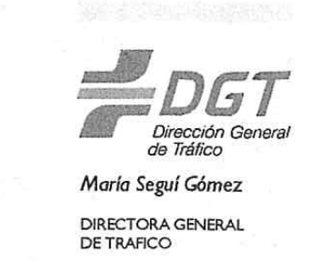
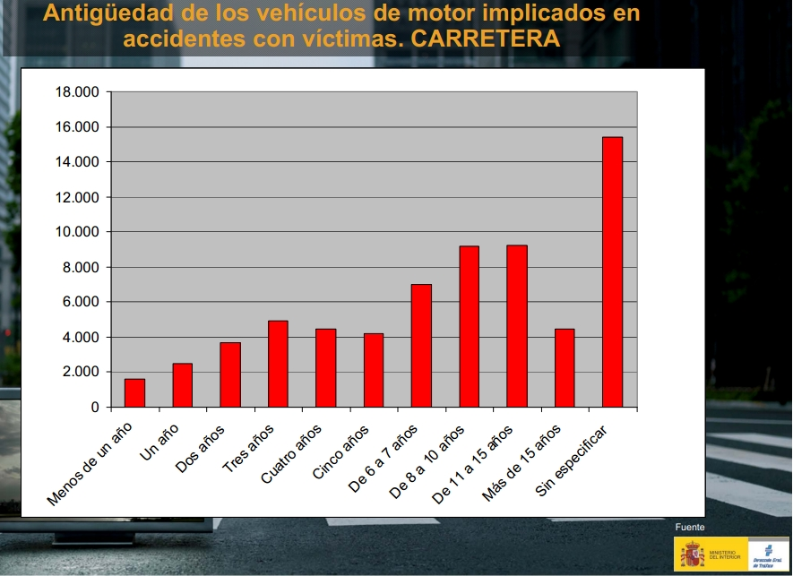

Estudio *provocado* por la carta de la DGT de 2013 informando a propietarios de coches con > 10 años antiguedad

   

***

¿Reciente estudio? ¿De quién? ¿Dónde está? 

Hay varios, que oscilan entre lo ¿burdo?

***

***

Y otro que publica resultados sin dato alguno que lo soporte

***

Y de ahí que:

## ¿Tenemos datos para corroborar / reproducir?

Preguntamos por datos accidentalidad en España y DGT fue muy amable por twitter señalar la siguiente [dirección web para microdatos](https://sedeapl.dgt.gob.es/WEB_IEST_CONSULTA/subcategoria.faces), aunque ¡ojo! en el último momento en que he consultado esta web sólo dispone de datos hasta 2013. 

Es interesante señalar que disponemos también de [informes predefinidos](https://sedeapl.dgt.gob.es/WEB_IEST_CONSULTA/buscadorInformePredefinido.faces), básicamente tablas que cruzan variables importantes de clasificación. (Y después de contestar a un captcha...)

## Miremos los datos pero antes...

¡¡ENLACE IMPRESCINDIBLE!! [El "diseño de registro"](https://sedeapl.dgt.gob.es/IEST_INTER/pdfs/disenoRegistro/accidentes/Diseno_Registro_desde_2011.zip)

Ojo por si alguien quiere hacer serie histórica de accidentes que a fecha de escribir esto (31-03-2016, los datos de 2008 y 2010 **no** estaban disponibles en la página DGT)

## Más

Noticia a bombo y platillo, pero [¿se han cumplido sus objetivos?](http://www.dgt.es/es/prensa/notas-de-prensa/2015/20150722-ya-esta-disponible-el-portal-estadistico-de-la-dgt.shtml
)
